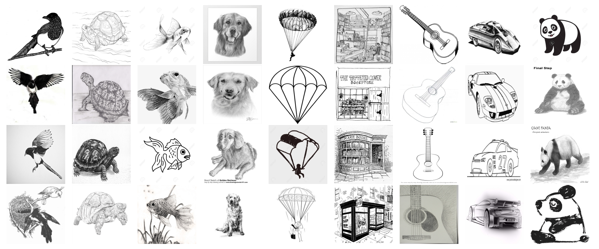

# ImageNet-Sketch

## Description

ImageNet-Sketch data set consists of 50000 images, 50 images for each of the 1000 ImageNet classes. 
We construct the data set with Google Image queries "sketch of \_\_", where \_\_ is the standard class name. 
We only search within the "black and white" color scheme.
We initially query 100 images for every class, and then manually clean the pulled images by deleting the irrelevant images and images that are for similar but different classes. 
For some classes, there are less than 50 images after manually cleaning, 
and then we augment the data set by flipping and rotating the images. 

This github repository consists of the scripts we used to conduct query and clean images. 

## Download the Data 

 - Links
     - from [Google Drive](https://drive.google.com/open?id=1Mj0i5HBthqH1p_yeXzsg22gZduvgoNeA)
     - from [Kaggle](https://www.kaggle.com/wanghaohan/imagenetsketch)
 - Information
     - zip file is 7.8 GB
     - extracted files will be 8.4 GB

## ImageNet-Sketch Leaderboard

|            Method                 |                                 Reference                  |   Backbone  |     From Scratch*    |   Top1-Acc.    |      Top5-Acc. |
|-----------------------------------|---------------------------------------------------------------|:-------:|:-------:| :-------:| :-------:|
| Texture Debiased Augmentation | [Hermann et al.](https://proceedings.neurips.cc/paper/2020/hash/db5f9f42a7157abe65bb145000b5871a-Abstract.html) (NeurIPS 2020) | ResNet50 | Y | 30.9%  |  51.4%
| Anisotropic diffusion | [Mishra et al.](https://arxiv.org/abs/2011.01901) | ResNet50 | Y | 24.49%   |  41.81%
| Random Convolutions | [Xu et al.](https://arxiv.org/abs/2007.13003) | AlexNet | Y | 18.09%   |  35.40%
| [RSC](https://github.com/DeLightCMU/RSC) | [Huang et al.](https://arxiv.org/abs/2007.02454) (ECCV 2020) | AlexNet | Y | 16.12%   |  30.78%
| [PAR](https://github.com/HaohanWang/PAR_experiments) | [Wang et al.](https://arxiv.org/abs/1905.13549) (NeurIPS 2019) | AlexNet | N | 13.06%   |  26.27%
| AlexNet Baseline                  |                                                               | AlexNet    | N/A | 12.04%   | 24.80%

*This column indicates whether the model is trained from the scratch or built and fine-tuned based a pretrained backbone model.

## Analysis 

 - An interesting analysis is performed at Kaggle, evaluating a large number of CNNs with our data set
     - [Can pretrained ImageNet models generalize to sketches](https://www.kaggle.com/rwightman/generalization-to-imagenet-sketch)
 - A comprehensive evaluation of popular vision models on ImageNet-Sketch
     - [Pytorch Image Models' performances on ImageNet Sketch (300+ models)](https://github.com/rwightman/pytorch-image-models/blob/master/results/results-sketch.csv)

## Reference

The data set is introduced together with the following paper in NeurIPS 2019, so if you find this data set helpful, please consider citing it: 
    
   [Learning Robust Global Representations by Penalizing Local Predictive Power](https://arxiv.org/abs/1905.13549)
   
@inproceedings{wang2019learning,  
&nbsp;&nbsp;&nbsp;&nbsp;&nbsp;&nbsp;&nbsp;&nbsp;title={Learning Robust Global Representations by Penalizing Local Predictive Power},  
&nbsp;&nbsp;&nbsp;&nbsp;&nbsp;&nbsp;&nbsp;&nbsp;author={Wang, Haohan and Ge, Songwei and Lipton, Zachary and Xing, Eric P},  
&nbsp;&nbsp;&nbsp;&nbsp;&nbsp;&nbsp;&nbsp;&nbsp;booktitle={Advances in Neural Information Processing Systems},  
&nbsp;&nbsp;&nbsp;&nbsp;&nbsp;&nbsp;&nbsp;&nbsp;pages={10506--10518},  
&nbsp;&nbsp;&nbsp;&nbsp;&nbsp;&nbsp;&nbsp;&nbsp;year={2019}  
}
